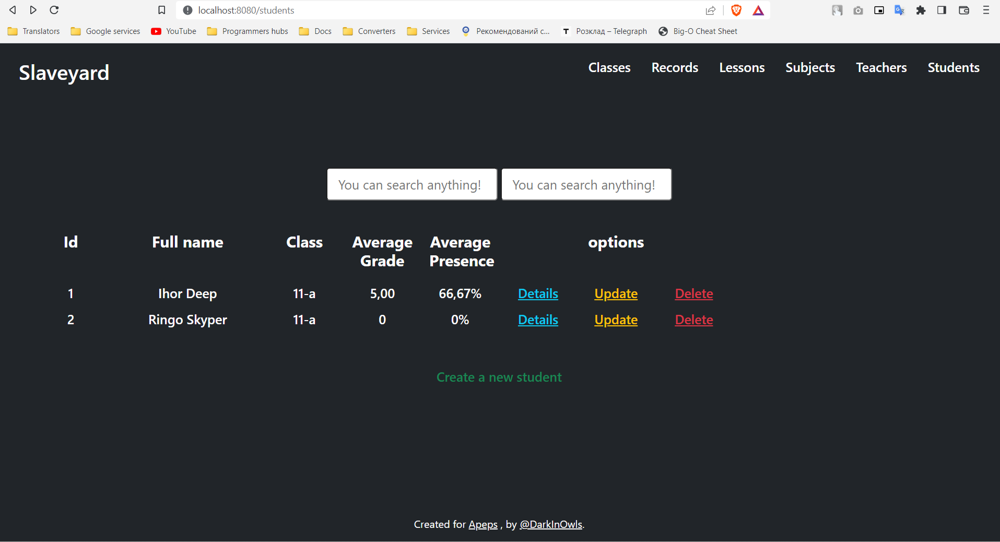
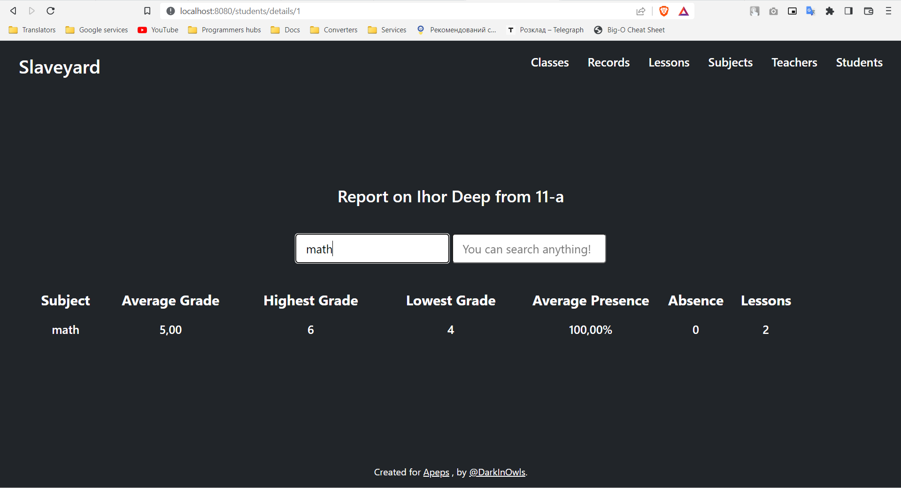

# Slaveyard

My coursework created using java spring framework 

Web-application created to manage pupils and teachers in a school

#### Requirements:

1. JDK - 17 version LTS
2. MySQL. There is a create_db.sql script to create the app database.

---

#### Photos:

###### List of students

###### The student report. Filtered by math subject.

> TODO: rewrite frontend with react or angular. Thymeleaf is cringe 

> TODO: Templates for the frontend

